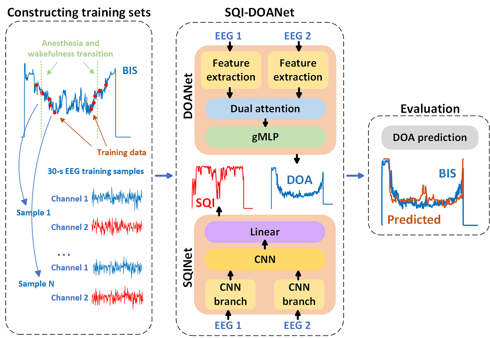
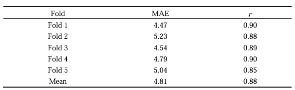
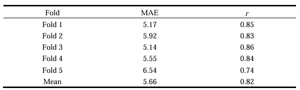

# SQI-DOANet: electroencephalogram-based deep neural network for estimating signal quality index and depth of anaesthesia

[](LICENSE) [](https://www.python.org/) [](https://pytorch.org/)

## News

- **2026-03-13**: The codebase has been updated and the end-to-end workflow is now available.

---

## Overview
Monitoring depth of anaesthesia (DOA) during surgery is critical, but intraoperative EEG is often contaminated by disturbances that degrade estimation accuracy.  
**SQI-DOANet** addresses this with two subnetworks:

- **SQINet**: a shallow CNN for fast EEG signal quality index (SQI) assessment.
- **DOANet**: a DOA estimation network composed of a feature extraction module, a dual attention module for multi-channel and multi-scale fusion, and a gated MLP module for temporal modeling.

The model was trained and evaluated on **VitalDB** with **BIS** as the reference, using **5-fold cross-validation**.



## Main Results
- **DOANet**
  - Pearson correlation with BIS: **0.88**
  - MAE: **4.81**
  - Result for DOANet


- **SQI-DOANet (overall)**
  - Mean Pearson correlation with BIS: **0.82**
  - MAE: **5.66**
  - Result for SQI-DOANet


## Citation
If this project or paper is helpful for your research, please cite:

```bibtex
@article{yu2024sqi_doanet,
  title   = {SQI-DOANet: electroencephalogram-based deep neural network for estimating signal quality index and depth of anaesthesia},
  author  = {Yu, Rui and Zhou, Zhen and Xu, Meng and Gao, Meng and Zhu, Ming and Wu, Shuliang and Gao, Xin and Bin, Gui},
  journal = {Journal of Neural Engineering},
  year    = {2024},
  volume  = {21},
  number  = {4},
  doi     = {10.1088/1741-2552/ad6592}
}
```

---

## Quickstart

### Environment Setup (Run First)

```python
pip install -r requirements.txt
```

### Data Preparation

**VitalDB** (https://vitaldb.net/) is a public, high-resolution perioperative database containing physiological waveforms and numeric vital-sign records collected during surgery.  
In this project, we use track metadata from `trks.csv` and download track-level data through the VitalDB API.

1. Download `trks.csv` from the VitalDB API:

```bash
wget https://api.vitaldb.net/trks -O download/trks.csv
```

2. Make sure the CSV file is saved at `download/trks.csv`.

3. Run the downloader script:

```bash
python download/download_data.py --output-dir mat
```

`--output-dir` is the new output directory parameter for choosing where `.mat` files are saved.

4. Create 5-fold split files from `.mat` data:

```bash
python script/split_kfold.py --mat-dir mat --output-dir splits --k-fold 5 --valid-ratio 0.2 --seed 42
```

This command generates five split files:

- `splits/fold_1.txt`
- `splits/fold_2.txt`
- `splits/fold_3.txt`
- `splits/fold_4.txt`
- `splits/fold_5.txt`

Each file contains three sections: `[train]`, `[valid]`, and `[test]`, with one `case*.mat` filename per line.  
Use these five txt files for 5-fold cross-validation training.

### Train DOANet (Standalone)

Use `DOANetTrain.py` to train only (no test).  
This script is standalone and does not depend on `code/`, and its sampling pipeline is aligned with `code/DataAdapter/EnsambleDataAdapter.py` (DOA path).

Data files in `--data-dir` must include:

- `case*.mat` only
- each mat should provide `EEG1`, `EEG2`, `SQI`, `BIS` (or equivalent fields inside `ref`)

```bash
python DOANetTrain.py \
  --split-file splits/fold_1.txt \
  --data-dir mat \
  --save-dir runs/doanet \
  --epochs 200 \
  --batch-size 128 \
  --lr 0.001 \
  --patience 20 \
  --input-len 3840
```

Outputs are saved under `runs/doanet/<run_name>/`:

- `DOANet_best_model.pt`
- `DOANet_last_model.pt`
- `train.log`
- `args.json`

### Train SQINet (Standalone)

Use `SQINetTrain.py` to run SQI training only (no test), aligned with `algorithm.train_sqi()` and `gen_sqi_data()`.

```bash
python SQINetTrain.py \
  --split-file splits/fold_1.txt \
  --data-dir mat \
  --save-dir runs/sqinet \
  --epochs 200 \
  --batch-size 128 \
  --lr 0.0001 \
  --patience 20 \
  --input-len 3840
```

Outputs are saved under `runs/sqinet/<run_name>/`:

- `SQI_best_model.pt`
- `SQI_last_model.pt`
- `train.log`
- `args.json`

### Test (DOANet + SQINet)

Run combined inference (aligned with `algorithm.test()` post-processing) and output prediction files only, one file per test sample.

```bash
python SQI_DOANetTest.py \
  --split-file splits/fold_1.txt \
  --data-dir mat \
  --doanet-model runs/doanet/<run_name>/DOANet_best_model.pt \
  --sqinet-model runs/sqinet/<run_name>/SQI_best_model.pt \
  --output-dir predictions/fold_1 \
  --batch-size 128 \
  --sqi-th 20
```

Output format:

- one CSV per sample, e.g. `predictions/fold_1/case3.csv`
- columns: `index`, `bis_pred`, `sqi_pred`, `bis_pred_masked`

### Evaluate

Evaluate prediction files and compute metrics.

```bash
python SQI_DOANetEvaluate.py \
  --split-file splits/fold_1.txt \
  --data-dir mat \
  --pred-dir predictions/fold_1 \
  --output-dir predictions/fold_1 \
  --use-masked-bis
```

Output files:

- `metrics_per_case.csv`
- `metrics_summary.json`
